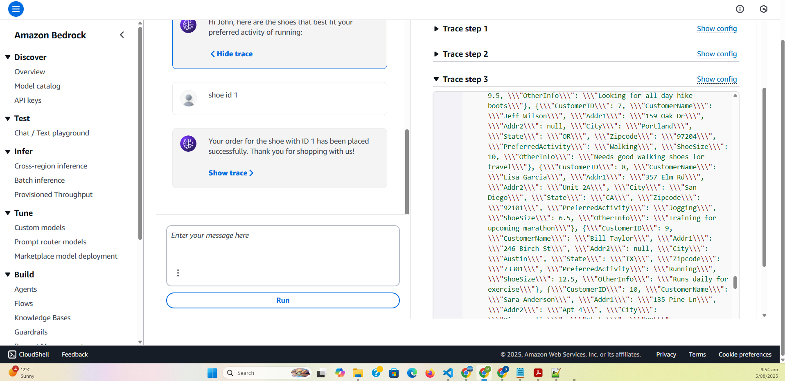

# Customer Service Agent

> The agent will find customer information, their shoe size, stocks and book order.

## Overview

Customer service agent is a serverless application that uses LLM model to interact with the customers. Take their information and prefrences. Book their order.

## Features

- Ask customer for their shoe preferences
- Uses Generative AI (LLM) to understand and take action on Natural language
- Serverless, scalable, and cloud-native

# Starting Point

This is just a starting point; it can be expanded to full shopping agent.

## Architecture

The solution is built using AWS Lambda, S3, AWS Bedrock agent. Infrastructure is managed via Terraform.

![Architecture Diagram]

## Technical Stack

- **Python**: 3.10
- **AWS S3**: Storage for DB
- **AWS Lambda**: Backend compute, interact with the Database
- **AWS Bedrock**: Generative AI agent for calling this tool.
- **Terraform**: Infrastructure as Code

## Repository

GitHub: [https://github.com/m3dcodie/customer_service_agent](https://github.com/m3dcodie/customer_service_agent)

## License

This project is licensed under the MIT License. You are free to fork and modify the code, but **attribution to the original author is required** in your derived works.

---

**Author:** Suhail T
